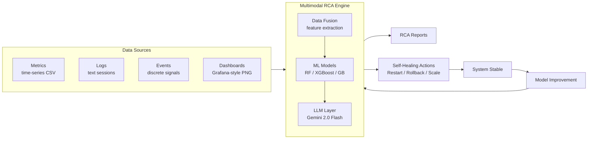

# Multimodal RCA Engine — Autonomous Root Cause Analysis for Cloud Systems

<div align="center">

**Multimodal Root Cause Analysis Engine for Cloud & Microservice Systems**

*Designing and developing an autonomous root cause analysis mechanism based on multimodal LLM and VLM in cloud systems*

[](https://www.python.org/)
[](https://jupyter.org/)
[](https://scikit-learn.org/)
[](https://ai.google.dev/)
[](#license)

</div>

---

## Project Overview

The **Multimodal RCA Engine** is a research platform for **autonomous root cause analysis (RCA)** in cloud and microservice environments. Modern infrastructure emits heterogeneous telemetry — time-series metrics, textual logs, monitoring dashboards, and discrete events — and the cause of an incident is rarely visible in any single signal. This project builds an end-to-end pipeline that **fuses multiple modalities**, detects anomalies, classifies their root cause, and produces human-readable explanations and remediation plans.

Because no public dataset jointly labels metrics, logs, and dashboards across a realistic set of infrastructure layers, the project ships its **own synthetic multimodal data generator** (the core contribution) and validates the trained models against **real-world log data** (HDFS / LogHub).

The engine has two complementary tracks:

| Track | Input data | Goal |
|-------|-----------|------|
| **Synthetic multimodal track** | Generated metrics + logs + dashboards | Train & benchmark anomaly-detection and RCA classifiers across 11 layers / 22 scenarios |
| **Real-log track** | LogHub datasets (HDFS, BGL, OpenStack) | Parse real logs (Drain3), engineer features, run LLM-based semantic analysis, and validate generalization |

A **Google Gemini 2.0 Flash** integration layer turns the structured ML output into natural-language explanations, expanded remediation steps, and executive reports.

---

## System Architecture



> **Implementation status of the data sources.** Metrics and logs are fully generated **and consumed** by the training pipeline. Dashboard images are **generated** (Grafana dark-theme renders) and are intended for the VLM / visual-analysis branch. The **Events** source and the closed-loop **self-healing** actuation are part of the target architecture; remediation today is produced as **recommendations** (from the scenario catalog and the Gemini layer), not yet executed automatically. See [Roadmap](#roadmap).

---

## Repository Structure

```
multimodal-rca-engine/
├── configs/
│   ├── anomaly_scenarios.yaml      # Source of truth: 11 layers × 2 scenarios = 22 anomalies
│   └── datasets.yaml               # Real dataset (LogHub) configuration
│
├── dataset_generator/             # Synthetic multimodal data engine
│   ├── metric_generator.py         #   Time-series metrics (baseline + 7 anomaly patterns)
│   ├── log_generator.py            #   ~300 realistic log templates, temporally aligned
│   ├── dashboard_generator.py      #   Grafana-style dashboard images (full / compact)
│   ├── dataset_builder.py          #   Orchestrator: assembles logs+metrics+dashboard+label
│   └── generate.py                 #   CLI entry point (presets: test → mega)
│
├── models/                        # Training & inference
│   ├── data_loader.py              #   Multimodal feature extraction + noise injection
│   ├── rca_models.py               #   AnomalyDetector, RCAClassifier, RemediationEngine
│   ├── train.py                    #   End-to-end training pipeline
│   └── gemini_explainer.py         #   Gemini 2.0 Flash explanation / remediation / chatbot
│
├── src/                           # Real-log pipeline utilities (used by notebooks/)
│   ├── log_parser.py               #   Drain3-based log parsing
│   ├── feature_extractor.py        #   Feature engineering on parsed logs
│   ├── rca_analyzer.py             #   RCA orchestration over real logs
│   ├── llm_engine.py               #   LLM prompting for semantic log analysis
│   └── utils.py
│
├── notebooks/                     # Real-log track (LogHub)
│   ├── 01_data_acquisition_exploration.ipynb
│   ├── 02_log_parsing.ipynb
│   ├── 03_feature_engineering.ipynb
│   ├── 04_llm_semantic_analysis.ipynb
│   └── 05_llm_rca_execution.ipynb
│
├── dataset_analysis/              # Synthetic-data track (analysis & modeling)
│   ├── 01_dataset_exploration.ipynb        # Explore the generated multimodal dataset
│   ├── 02_model_training.ipynb             # Feature extraction + RF training & RCA
│   ├── 03_multi_model_comparison.ipynb     # RF / GB / LogReg / KNN / MLP comparison
│   ├── 04_real_data_validation.ipynb       # Validate on real HDFS logs (LogHub)
│   ├── 05_deep_learning_log_anomaly.ipynb  # Deep-learning log anomaly detection
│   └── 06_gemini_rca_explainer.ipynb       # Gemini natural-language RCA & chatbot
│
├── data/                          # (large artifacts gitignored)
│   ├── multimodal_dataset/         #   Generated dataset (logs/ metrics/ dashboards/ labels/ + metadata.csv)
│   ├── raw/                        #   Raw LogHub downloads (HDFS, BGL, OpenStack)
│   ├── parsed/                     #   Parsed real logs
│   └── processed/                  #   Engineered features & pipeline configs
│
├── results/                       # Figures, model_results.json, gemini_rca_report.md
├── demo_gemini.py                 # Standalone Gemini integration demo (no ML required)
├── requirements.txt
└── README.md
```

---

## The Synthetic Multimodal Dataset

This is the heart of the project. Everything is driven by a single config file, [`configs/anomaly_scenarios.yaml`](configs/anomaly_scenarios.yaml), which defines **11 infrastructure layers**, each with **2 anomaly scenarios** (22 total). Adding a new layer or scenario requires **only a YAML edit** — no code changes.

### Infrastructure layers & scenarios

| Layer | Example metrics | Scenarios |
|-------|-----------------|-----------|
| CDN | request_count, response_time_ms, cache_hit_ratio | Sudden Traffic Spike · Response Time Increase |
| Firewall | connection_attempts, blocked_connections, bandwidth_mbps | Increased Blocked Connections · High Bandwidth Usage |
| Proxy | request_rate, response_time_ms, load_average | Error Rate Surge · Response Latency |
| Kubernetes Ingress | request_rate, error_rate, lb_utilization_pct | High Error Rate · Unbalanced Traffic |
| Kubernetes Deployments | pod_count, cpu_usage_pct, restart_count | Pod Restart Increase · CPU Usage Increase |
| Application | qps, error_rate, response_time_ms, availability_pct | Processing Time Increase · Error Rate Increase |
| Database | query_response_ms, connection_count, slow_query_count | Slow Query Increase · Connection Count Increase |
| Storage | disk_usage_pct, iops, latency_ms, disk_error_count | High Disk Usage · Latency Increase |
| Network | packet_loss_pct, latency_ms, connection_errors | Packet Loss Increase · Excessive Latency |
| Linux VM | cpu_usage_pct, memory_usage_pct, load_average | CPU Usage Surge · Memory Exhaustion |
| Linux Host | temperature_c, fan_speed_rpm, disk_usage_pct | CPU Temperature Increase · Disk Error Increase |

Each scenario carries: `root_cause`, `root_cause_category` (network / software / resource / config / hardware), `severity` (critical / high / medium), `remediation` steps, and `affected_metrics` with the exact anomaly pattern and magnitude range.

### What a single sample looks like

Every sample is a temporally aligned bundle written to four sub-directories:

| File | Modality | Contents |
|------|----------|----------|
| `metrics/{id}.csv` | Time-series | 60 points (1 hour @ 1-min resolution) for that layer's metrics |
| `logs/{id}.txt` | Text | 20–60 timestamped log lines (`INFO`/`WARN`/`ERROR`/`CRITICAL`) |
| `dashboards/{id}.png` | Image | Grafana dark-theme multi-panel or compact overlay |
| `labels/{id}.json` | Ground truth | `is_anomaly`, `scenario_id`, `root_cause`, `severity`, `remediation`, `anomaly_start_idx`, … |

A global `metadata.csv` indexes all samples for fast loading.

### Realism by design (anti-overfitting)

A naive synthetic generator produces trivially separable data and meaningless 100% accuracy. This generator deliberately injects difficulty:

- **Noisy baselines** — metrics combine higher-variance Gaussian noise, a slow diurnal drift, lag-1 autocorrelation, and *random natural micro-spikes*. Normal systems spike too.
- **Overlapping log distributions** — even normal sessions emit `ERROR` (~15%) and `CRITICAL` (~5%); anomalous sessions still emit plenty of `INFO`. Per-sample random variation is added on top.
- **Temporal alignment** — the same `anomaly_start_idx` drives both the metric injection and a progressive shift of log levels toward `ERROR`/`CRITICAL`, so modalities are genuinely correlated rather than independent.
- **Positional feature names** — at feature-extraction time, metrics are renamed `m0, m1, …` and normalized to `[0,1]`, so a model cannot identify the layer just from *which* metrics exist; it must learn the statistical patterns.
- **Measurement noise & dropout** — Gaussian noise (`noise_level=0.25`) and random **feature dropout** (~8%, simulating missing sensors) are applied during loading, plus ~12% noise on log-level counts (imperfect parsers).

### Anomaly patterns

Seven injection patterns are implemented in [`metric_generator.py`](dataset_generator/metric_generator.py): `sudden_spike`, `gradual_rise`, `gradual_drop`, `sudden_drop`, `sustained_high`, `oscillation`, `step_increase`. Multiplicative ranges are used for volume-like metrics; additive ranges for rate-like metrics (e.g. `error_rate`).

### Generating the dataset

```bash
# Quick verification (~165 samples)
python dataset_generator/generate.py --test

# Presets
python dataset_generator/generate.py --size small     #   1,000 samples
python dataset_generator/generate.py --size medium     #  10,000 samples
python dataset_generator/generate.py --size full       # 100,000 samples

# Custom
python dataset_generator/generate.py --total 50000 --anomaly-ratio 0.5

# Dashboard mode & speed
python dataset_generator/generate.py --size medium --dashboard full     # multi-panel (slower)
python dataset_generator/generate.py --size medium --no-dashboard        # skip images (fastest)
```

| Preset | Samples | Approx. time |
|--------|---------|--------------|
| `test` | 165 | seconds |
| `small` | 1,000 | ~1 min |
| `medium` | 10,000 | ~10 min |
| `large` | 50,000 | ~45 min |
| `full` | 100,000 | ~90 min |

Output defaults to `data/multimodal_dataset/`. Generation is reproducible (per-sample seeding).

---

## Models & Training Pipeline

`models/train.py` runs the full pipeline: load → extract features → split (70/10/20, stratified) → train → evaluate → save.

**Modalities fused for the tabular models:**
- **Metric features** — per-metric statistical descriptors (mean, std, range, median, skew, kurtosis, slope, spike score, change-point score, volatility, lag-1 autocorrelation), padded to a fixed 8-metric layout.
- **Log features** — level counts and ratios, severity score (noised).
- **Log text** — TF-IDF (top 100 terms).

**Two model families:**
1. `AnomalyDetector` — binary Normal vs Anomaly. Combines metric + log + TF-IDF features.
2. `RCAClassifier` — multi-class heads (trained on anomalous samples only) for **root_cause_category**, **severity**, **layer**, and **scenario**.
3. `RemediationEngine` — maps a predicted `scenario_id` back to its remediation actions from the YAML catalog.

Supported estimators: Random Forest (default), XGBoost, Gradient Boosting, Logistic Regression — selectable via `--model`.

```bash
# Train the default Random Forest pipeline
python models/train.py

# Limit samples / pick a model / compare all
python models/train.py --max-samples 5000
python models/train.py --model xgboost
python models/train.py --compare
```

### Benchmark results (synthetic test set, 10,000 samples, Random Forest)

| Task | Accuracy | F1 | AUC-ROC |
|------|---------:|---:|--------:|
| **Anomaly detection** | 0.9845 | 0.9845 | 0.9984 |
| Root-cause category | 0.9730 | 0.9728 | — |
| Severity | 0.9510 | 0.9502 | — |
| Layer | 0.9870 | 0.9870 | — |
| Scenario (22-class) | 0.9790 | 0.9788 | — |

> **Interpret with care.** These scores are measured on **synthetic data drawn from the same generative process** as the training set. Despite the anti-overfitting measures, they primarily confirm the pipeline is sound — they do **not** by themselves prove real-world generalization. The decisive test is the **real-data validation** notebook (`dataset_analysis/04_real_data_validation.ipynb`) on HDFS logs from LogHub.

---

## LLM Layer — Gemini 2.0 Flash

`models/gemini_explainer.py` enriches the structured ML output with natural language (English or Turkish):

- `explain_anomaly()` — plain-language explanation of a detected scenario for operators.
- `expand_remediation()` — turns terse remediation steps into a prioritized, command-level plan with verification criteria.
- `analyze_logs()` — interprets the extracted log feature vector.
- `chat()` — free-text RCA assistant.
- `generate_full_report()` — executive markdown summary across a diagnosis session.

Try it without any ML:

```bash
# 1. Put your key in .env  (GEMINI_API_KEY=...)
# 2. Run the demo
python demo_gemini.py
```

---

## Real-Data Validation (LogHub)

The project does not stop at synthetic data. Using the datasets configured in [`configs/datasets.yaml`](configs/datasets.yaml):

| Source | Dataset | Description |
|--------|---------|-------------|
| [LogHub](https://github.com/logpai/loghub) | HDFS_v1 | Hadoop logs with block-level anomaly labels (575K sessions, 29 event types) |
| [LogHub](https://github.com/logpai/loghub) | BGL | Blue Gene/L supercomputer logs |
| [LogHub](https://github.com/logpai/loghub) | OpenStack | Cloud platform logs |

The real-log track parses these with **Drain3**, engineers features, runs **LLM semantic analysis**, and the `04_real_data_validation` notebook tests how models trained on synthetic data transfer to real HDFS logs.

---

## Getting Started

### 1. Clone & set up

```bash
git clone https://github.com/NANITH777/multimodal-rca-engine.git
cd multimodal-rca-engine

python -m venv venv
venv\Scripts\activate          # Windows
# source venv/bin/activate     # Linux / macOS

pip install -r requirements.txt
```

### 2. Configure the LLM key (optional, for the Gemini layer)

```bash
cp .env.example .env
# edit .env and set GEMINI_API_KEY=your_real_key
```

> **Security note:** never commit a real API key. Keep `.env` out of version control (it is gitignored) and rotate any key that has ever been pushed.

### 3. Generate data and train

```bash
python dataset_generator/generate.py --size medium
python models/train.py
```

### 4. Explore the notebooks

```bash
jupyter notebook
```
- Synthetic track: open `dataset_analysis/01 → 06` in order.
- Real-log track: open `notebooks/01 → 05` in order.

---

## Tech Stack

- **Data / ML:** NumPy, pandas, scikit-learn, XGBoost, SciPy
- **Log parsing:** Drain3
- **Visualization:** Matplotlib, Seaborn, Plotly (Grafana-style dashboards)
- **NLP:** TF-IDF (scikit-learn), NLTK
- **LLM:** Google Gemini 2.0 Flash (`google-generativeai`)
- **Notebooks:** Jupyter, ipywidgets

See [`requirements.txt`](requirements.txt) for pinned versions.

---

## Roadmap

- [ ] **Wire dashboards into the pipeline** — add a visual (VLM/CNN) branch that consumes the generated dashboard images, fulfilling the "multimodal LLM **and VLM**" goal.
- [ ] **Add a synthetic Events modality** — discrete event streams (e.g. `OOMKilled`, `Deployment scaled`, `Alert fired`) aligned to `anomaly_start_idx`, as a true fourth source.
- [ ] **Close the self-healing loop** — execute remediation actions (restart / rollback / scale) in a sandboxed environment and feed outcomes back into model improvement.
- [ ] **Expand real-data validation** to BGL and OpenStack, not just HDFS.

---

## Citations

```bibtex
@inproceedings{zhu2023loghub,
  title     = {Loghub: A Large Collection of System Log Datasets for AI-driven Log Analytics},
  author    = {Zhu, Jieming and He, Shilin and He, Pinjia and Liu, Jinyang and Lyu, Michael R.},
  booktitle = {ISSRE},
  year      = {2023}
}
```

---

## License

Released for **research and educational** purposes.

---

<div align="center">

*Kocaeli University — TÜBİTAK Project*

</div>
